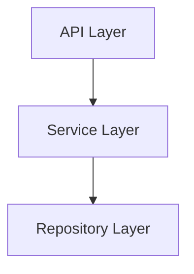

# Software Architecture Document

## 1. Introduction

### 1.1 Purpose

This document provides a comprehensive architectural overview of the system, using a number of different architectural views to depict different aspects of the system. It is intended to capture and convey the significant architectural descisions which have been made on the system.

### 1.2 Scope

This Software Architecture Document provides an architectural overview of the Pilates Princesses Food Delivery Application.

---

## 2. Architectural Representation

This document presents the architecture as a series of views; use case view, logical view and process view. These are views on an underlying Unified Modeling Language (UML) model of the system.

---

## 3. Use Case View

A description of the use-case view of the software architecture. The Use Case View describes the system's functionality and its interactions with external actors. It captures the requirements of the system and provides a high-level overview of how the system will be used.

The Application use cases are:

- View Restaurants
- View Menus
- Create Restaurants
- Manage Menus
- Manage Restaurant Information

### 3.1 Architecturally-Significant Use Cases

```mermaid
flowchart LR

    Customer@{shape: person, label: "Customer"} --> ViewRestaurants(View Restaurants)
    Customer --> ViewRestaurantInformation(View Restaurant Information)
    Customer --> ViewMenus(View Menus)
    RestaurantOwner@{shape: person, label: "Restaurant Owner"} --> CreateRestaurants(Create Restaurants)
    RestaurantOwner --> ManageMenu(Manage Menu)
    RestaurantOwner --> ManageRestaurantInformation(Manage Restaurant Information)
```

#### 3.1.1 View Restaurants

This use case allows a Customer to view a list of all restaurants in the system. Restaurants are displayed with their name, address, and cuisine type. The Customer can select a restaurant to view its menu.

#### 3.1.2 View Menus

This use case allows a Customer to view the menu of a slected restaurant. The menu displays the available items, including their name, description, and price.

#### 3.1.4 Create Restaurants

This use case allows a Restaurant Owner to create a new restaurant in the system. The Restaurant Owner provides the restaurant's name, address, and cuisine type. The system validates the input and creates the restaurant if the input is valid.

#### 3.1.5 Manage Menus

This use case allows a Restaurant Owner to manage the menu of their restaurant. The Restaurant Owner can add and update menu items, including their name, description, and price. The system validates the input and updates the menu if the input is valid.

#### 3.1.6 Manage Restaurant Information

This use case allows a Restaurant Owner to manage the information of their restaurant. The Restaurant Owner can update the restaurant's name, address, and cuisine type. The system validates the input and updates the restaurant information if the input is valid.

---

## 4. Logical View

This section describes the logical view of the architecture. It describes the most important classes, thier organization in service packages and subsystems, and the organization of theses subsystems into layers. It also describes the most important use-case realizations. Class diagrams may be included to illustrate the relationships between architecturaly signifiant classes.

The logical view of the Application is organized into the following layers:



### 4.1 API Layer

The API layer has all the endpoints for the application. It is responsible for handling incoming requests, and returning responses.

### 4.2 Service Layer

The Service layer contains the business logic of the application. It is responsible for processing requests from the API layer, validating user input, and interacting with the Repository layer to retrieve and store data.

### 4.3 Repository Layer

The Repository layer is responsible for interacting with the database. It provides methods for retrieving and storing data, and abstracts the underlying database implementation from the rest of the application.

---
