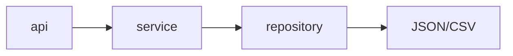
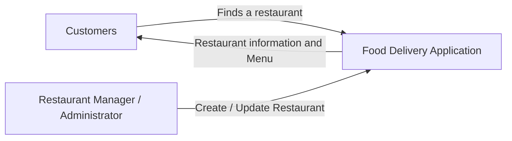
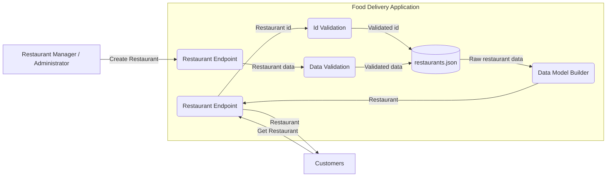
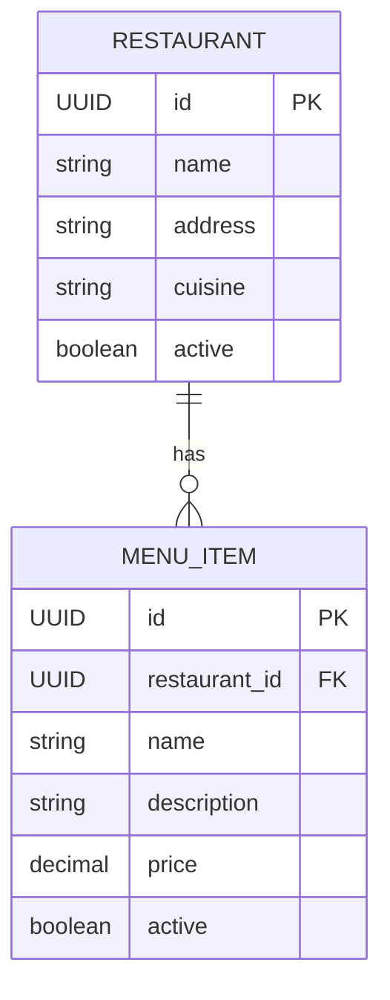
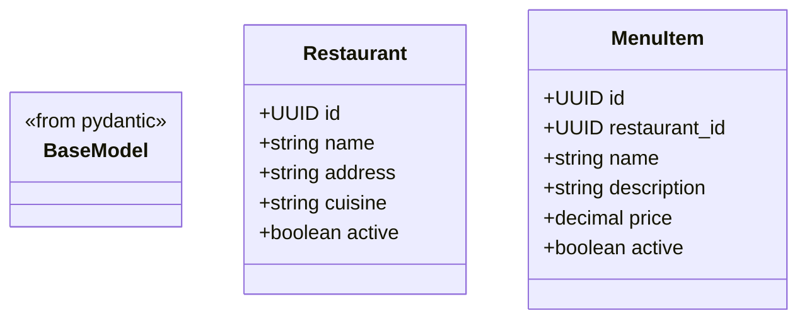
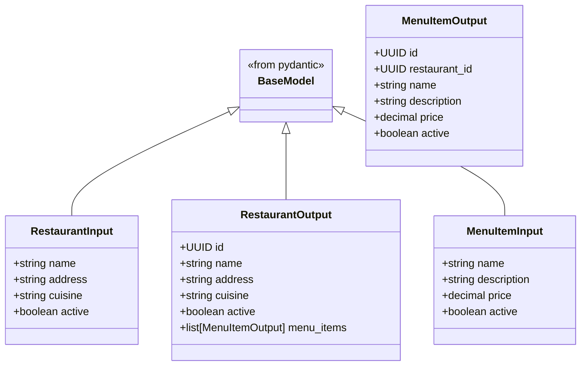

# Software Requirements Specification <!-- omit from toc -->

<!-- Update this information each milestone -->

**Objective:** A Restaurant Library where customers can view search for restaurats, filter restaurants by cuisine type, and veiw the details of a single restaurant. Restaurant owners can create a new restaurant, manage thier restaurant's information, and manage thier restaurant's menu.

**Current Milestone:** Milestone 1

## Table Of Contents <!-- omit from toc -->

- [1. Introduction](#1-introduction)
  - [1.1 Purpose](#11-purpose)
  - [1.2 Document Conventions](#12-document-conventions)
  - [1.3 Scope ](#13-scope-)
    - [1.3.1 In Scope](#131-in-scope)
    - [1.3.2 Specifically Out of Scope](#132-specifically-out-of-scope)
  - [1.4 Definitions \& Acronyms ](#14-definitions--acronyms-)
- [2. Overall Description](#2-overall-description)
  - [2.1 Product Perspective](#21-product-perspective)
  - [2.2 High-Level Architecture](#22-high-level-architecture)
  - [2.2.1 API Layer](#221-api-layer)
  - [2.2.2 Service Layer](#222-service-layer)
  - [2.2.3 Repository Layer](#223-repository-layer)
  - [2.3 Product Functions](#23-product-functions)
  - [2.4 Required Architecture](#24-required-architecture)
  - [2.5 Design and Implementation Constraints](#25-design-and-implementation-constraints)
- [3. Sytem Features and Functional Requirements](#3-sytem-features-and-functional-requirements)
  - [3.1 Database](#31-database)
    - [3.1.1 Restaurants Database](#311-restaurants-database)
    - [3.1.2 Menu Items Database](#312-menu-items-database)
  - [3.2 Pydantic Models](#32-pydantic-models)
    - [3.2.1 Restaurant Model](#321-restaurant-model)
    - [3.2.2 Menu Item Model](#322-menu-item-model)
    - [3.2.3 Restaurant Input Model](#323-restaurant-input-model)
    - [3.2.4 Restaurant Output Model](#324-restaurant-output-model)
    - [3.2.4 Menu Item Input Model](#324-menu-item-input-model)
    - [3.2.5 Menu Item Output Model](#325-menu-item-output-model)
  - [3.3 Repository](#33-repository)
    - [3.3.1 Restaurant Repository](#331-restaurant-repository)
    - [3.3.2 Menu Item Repository](#332-menu-item-repository)
  - [3.4 API Routes](#34-api-routes)
    - [3.4.1 Customer Restaurants API Route](#341-customer-restaurants-api-route)
    - [3.4.2 Restaurant Owner Restaurant API](#342-restaurant-owner-restaurant-api)
    - [3.4.3 Restaurant Owner Menu Item API](#343-restaurant-owner-menu-item-api)
  - [3.5 Services](#35-services)
    - [3.5.1 Restaurant Services](#351-restaurant-services)
    - [3.5.2 Menu Item Services](#352-menu-item-services)
- [4. External Interface Requirements](#4-external-interface-requirements)
  - [4.1 User Interfaces](#41-user-interfaces)
    - [4.1.1 Customer User Interface](#411-customer-user-interface)
    - [4.1.2 Restaurant Owner User Interface](#412-restaurant-owner-user-interface)
- [5. Non-Functional Requirements](#5-non-functional-requirements)
  - [5.1 README Documentation](#51-readme-documentation)
- [6. Additional Notes](#6-additional-notes)
  - [6.1 Unique Ids \& Data Validation](#61-unique-ids--data-validation)
- [Appendix A: Analysis Models](#appendix-a-analysis-models)
  - [i. Use Case Diagram](#i-use-case-diagram)
  - [ii. Context Diagram](#ii-context-diagram)
  - [iii. Data Flow Diagrams](#iii-data-flow-diagrams)
  - [iv. Database Schema](#iv-database-schema)
  - [v. Data Models](#v-data-models)


---

## 1. Introduction

### 1.1 Purpose

This Software Requirements Specification (SRS) document provides a comprehensive description of the Food Delivery Application for the current milestone. The document details the functional and non-functional requirements for the application.

This SRS will serve as the foundation for the subsequent system design and development phases, ensuring that all group members have a clear understanding of what the system will do and how it will operate.


### 1.2 Document Conventions

This document will follow these conventions:

| **Term** | **Description** |
| --- | --- |
| **SHALL** | Refers to a mandatory requirement that must be fufilled for Milestone 1. The group is required to cover this feature in the current implementation phase. |
| **SHOULD** | Indicates a requirement that is not required for this milestone, but may be included |
| **MAY** | Indicates a requirement that is not required for the next two milestones, but may be included in future iterations of the project. |

Requirements are categorized as follows:

| **Requirement Number** | **Description** |
| --- | --- |
| FR- | Functional Requirements |
| NFR- | Non-Functional Requirements |
| DATA- | Data requirements |
| TEST- | Testing requirements |

Every requirement category has its own sub-categories and a unique requirement number for that sub-category.

Examples: `FR-REPO-001` or `FR-API-001`


### 1.3 Scope <!-- needs to be updated for each milestone -->

#### 1.3.1 In Scope

The application will include the following key components:

- View a list of restaurants
- Retrieve the details of a specific restaurant
- view menus from restaurants
- search or filter restaurants
- Creating a restaurant
- Updating retaurant information
- Adding menu items
- Updating menu items

#### 1.3.2 Specifically Out of Scope

- Customer registration
- Restaurant Owner registration
- Authentication
- Authorization
- Shopping Carts
- Checkout
- Orders
- Deliveries

### 1.4 Definitions & Acronyms <!-- needs to be updated for each milestone -->

- **Mutex:** Mutual Exclusion Lock
- **CRUD**: Create, Read Update, and Delete operations

---

## 2. Overall Description

### 2.1 Product Perspective

This stage of the Food Delivery Application is a more comprehensive API, expanding restaurants to include restaurant menu items, along with expanded CRUD for all data.

### 2.2 High-Level Architecture

The Food Delivery Application will follow a layered architecture, consisting of three main layers: the API layer, the Service layer, and the Repository layer. Each layer has distinct responsibilities and interacts with the other layers to provide a cohesive system.

### 2.2.1 API Layer

Handles incoming HTTP requests, and routes them to the appropriate service layer functions. Responsible for request validation, response formatting, and error handling.


### 2.2.2 Service Layer

Handles the orchestration of the application and enforces the business logic. Responsible for validating user input, and interacting with the Repository layer to retrieve and store data.

### 2.2.3 Repository Layer

Handles interaction with the data storage, and performing queries on the data. The repository layer is responsible for reading and writing data to the JSON or CSV files, and ensuring that concurrent write locks are handled properly to prevent data corruption.


### 2.3 Product Functions

This stage of the Food Delivery Application will provide the following major functions:

1. **Restaurant Management**
  - Creating new restaurants
  - Updating existing restaurants
  - Adding menu items
  - Updating menu items
2. **Customer Functionality**
  - Viewing a list of all restaurants
  - Search or filter restaurants
  - Viewing the details of a specific restaurant
  - Viewing a list of menu items of a restaurant

### 2.4 Required Architecture

All interaction between the client and the data must follow the following architecture:



The client never sees any JSON from `data/`, instead only recieving proper Pydantic models.
The API endpoint is cannot hard-code any 

### 2.5 Design and Implementation Constraints

- Data must be saved as JSON or CSV; No databases are permitted.
- Local file I/O operations must handle concurrent write locks

---

## 3. Sytem Features and Functional Requirements

This section details the functional requirements organized by major system features. Each requirement is identified wih a [unique Id](#12-document-conventions) for treaceability and reference.

---

### 3.1 Database

For more information on the [Database Schema](#iv-database-schema) and [Data Models](#v-data-models), please refer to[Appendix A](#appendix-a-analysis-models).

#### 3.1.1 Restaurants Database

- **DATA-RST-001:** Restaurants SHALL be stored in `data/restaurants.json`
- **DATA-RST-002:** A Restaurant SHALL have a unique id.
- **DATA-RST-003:** A Restaurant SHALL have a name
- **DATA-RST-004:** A restaurant SHALL have a address.
- **DATA-RST-005:** A restaurant SHALL have a cuisine.
- **DATA-RST-006:** A restaurant SHALL have an `active` flag

#### 3.1.2 Menu Items Database

- **DATA-MUI-001:** Menu Items SHALL be stored in `data/menu_items.json`
- **DATA-MUI-002:** A Menu Item SHALL have a unique id.
- **DATA-MUI-003:** A Menu Item SHALL have a link to an exisitng restaurant
- **DATA-MUI-004:** A Menu Item SHALL have a name
- **DATA-MUI-005:** A Menu Item SHALL have a description
- **DATA-MUI-006:** A Menu Item SHALL have a price
- **DATA-MUI-007:** A Menu Item SHALL have an `active` flag

---

### 3.2 Pydantic Models

#### 3.2.1 Restaurant Model

- **DATA-PYD-001:** The `Restaurant` model SHALL have an id
  - **DATA-PYD-001.1:** The `Restaurant` model id SHALL be a UUID
  - **DATA-PYD-001.2:** The `Restaurant` model id SHALL be [unique](Api-Specification.md)
  - **DATA-PYD-001.3:** The `Restaurant` model id SHALL be generated automatically upon creation
  - **DATA-PYD-001.4:** The `Restaurant` model id SHALL be immutable once set
- **DATA-PYD-002:** The `Restaurant` model SHALL have a name
  - **DATA-PYD-002.1:** The name SHALL be a non-empty string
- **DATA-PYD-003:** The `Restaurant` model SHALL have an address
  - **DATA-PYD-003.1:** The address SHALL be a non-empty string
- **DATA-PYD-004:** The `Restaurant` model SHALL have a cuisine
  - **DATA-PYD-004.1:** The cuisine SHALL be a non-empty string
- **DATA-PYD-005:** The `Restaurant` model SHALL have an `active` flag
  - **DATA-PYD-005.1:** The `active` flag SHALL be a boolean

#### 3.2.2 Menu Item Model

- **DATA-PYD-006:** The `MenuItem` model SHALL have an id
  - **DATA-PYD-006.1:** The `MenuItem` model id SHALL be a UUID
  - **DATA-PYD-006.2:** The `MenuItem` model id SHALL be [unique](Api-Specification.md)
  - **DATA-PYD-006.3:** THe `MenuItem` model id SHALL be generated automatically upon creation
  - **DATA-PYD-006.4:** The `MenuItem` model id SHALL be immutable once set
- **DATA-PYD-007:** The `MenuItem` model SHALL have a restaurant_id
  - **DATA-PYD-007.1:** The restaurant_id SHALL be a UUID
  - **DATA-PYD-007.2:** The restaurant_id SHALL reference an existing restaurant
  - **DATA-PYD-007.3:** The restaurant_id SHALL be immutable once set
- **DATA-PYD-008:** The `MenuItem` model SHALL have a name
  - **DATA-PYD-008.1:** The name SHALL be a non-empty string
- **DATA-PYD-009:** The `MenuItem` model SHALL have a description
  - **DATA-PYD-009.1:** The description SHALL be a non-empty string
  - **DATA-PYD-009.2:** The description SHALL have a maximum length of 500 characters
- **DATA-PYD-010:** The `MenuItem` model SHALL have a price
  - **DATA-PYD-010.1:** The price SHALL be a Decimal
  - **DATA-PYD-010.2:** The price SHALL be greater than or equal to 0.0
  - **DATA-PYD-010.3:** The price SHALL have at most 2 decimal places

#### 3.2.3 Restaurant Input Model

- **DATA-PYD-011:** The `RestaurantInput` model SHALL have a name
  - **DATA-PYD-011.1:** The name SHALL be a non-empty string
- **DATA-PYD-012:** The `RestaurantInput` model SHALL have an address
  - **DATA-PYD-012.1:** The address SHALL be a non-empty string
- **DATA-PYD-013:** The `RestaurantInput` model SHALL have a cuisine
  - **DATA-PYD-013.1:** The cuisine SHALL be a non-empty string

#### 3.2.4 Restaurant Output Model

- **DATA-PYD-014:** The `RestauantOutput` model SHALL have an id
  - **DATA-PYD-014.1:** The `RestaurantOutput` model id SHALL be a UUID
  - **DATA-PYD-014.2:** The `RestaurantOutput` model id SHALL be [unique]
- **DATA-PYD-015:** The `RestaurantOutput` model SHALL have a name
  - **DATA-PYD-015.1:** The name SHALL be a non-empty string
- **DATA-PYD-016:** The `RestaurantOutput` model SHALL have an address
  - **DATA-PYD-016.1:** The address SHALL be a non-empty string
- **DATA-PYD-017:** The `RestaurantOutput` model SHALL have a cuisine
  - **DATA-PYD-017.1:** The cuisine SHALL be a non-empty string
- **DATA-PYD-018:** The `RestaurantOutput` model SHALL have an `active` flag
  - **DATA-PYD-018.1:** The `active` flag SHALL be a boolean
- **DATA-PYD-019:** The `RestaurantOutput` model SHALL have a list of menu items
  - **DATA-PYD-019.1:** The list of menu items SHALL be a list of `MenuItem` models
  - **DATA-PYD-019.2:** The list of menu items SHALL be empty if the restaurant has no menu items

#### 3.2.4 Menu Item Input Model

- **DATA-PYD-020:** The `MenuItemInput` model SHALL have a name
  - **DATA-PYD-020.1:** The name SHALL be a non-empty string
- **DATA-PYD-021:** The `MenuItemInput` model SHALL have a description
  - **DATA-PYD-021.1:** The description SHALL be a non-empty string
  - **DATA-PYD-021.2:** The description SHALL have a maximum length of 500 characters
- **DATA-PYD-022:** The `MenuItemInput` model SHALL have a price
  - **DATA-PYD-022.1:** The price SHALL be a Decimal
  - **DATA-PYD-022.2:** The price SHALL be greater than or equal to 0.0
  - **DATA-PYD-022.3:** The price SHALL have at most 2 decimal places

#### 3.2.5 Menu Item Output Model

- **DATA-PYD-023:** The `MenuItemOutput` model SHALL have an id
  - **DATA-PYD-023.1:** The `MenuItemOutput` model id SHALL be a UUID
  - **DATA-PYD-023.2:** The `MenuItemOutput` model id SHALL be [unique]
- **DATA-PYD-024:** The `MenuItemOutput` model SHALL have a name
  - **DATA-PYD-024.1:** The name SHALL be a non-empty string
- **DATA-PYD-025:** THe `MenuItemOutput` model SHALL have a description
  - **DATA-PYD-025.1:** The description SHALL be a non-empty string
  - **DATA-PYD-025.2:** The description SHALL have a maximum length of 500 characters
- **DATA-PYD-026:** The `MenuItemOutput` model SHALL have a price
  - **DATA-PYD-026.1:** The price SHALL be a Decimal
  - **DATA-PYD-026.2:** The price SHALL be greater than or equal to 0.0
  - **DATA-PYD-026.3:** The price SHALL have at most 2 decimal places
- **DATA-PYD-027:** The `MenuItemOutput` model SHALL have an `active` flag

---

### 3.3 Repository

- **FR-REPO-001:** A repository SHALL have a file path to a JSON or CSV file
- **FR-REPO-002:** A repository SHALL be able to write ti the file
- **FR-REPO-003:** A repository SHALL be able to read from the file
- **FR-REPO-004:** A repository SHALL be able to handle concurrent write locks to the file
- **FR-REPO-005**: A repository SHALL be able to handle file not found errors gracefully
  - **FR-REPO-005.1:** The repository SHALL return an empty list if the file is not found
  - **FR-REPO-005.2:** The repository SHALL create a new file if the file is not found when writing data
- **FR-REPO-006:** A repository SHALL be able to be able to return a list of all items in the repository
- **FR-REPO-007:** A repository SHALL be able to retrieve an item by its unique id
  - **FR-REPO-007.1:** The repository SHALL return `None` if the item is not found
- **FR-REPO-008:** A repository SHALL be able to add a new item to the file
- **FR-REPO-009:** A repository SHALL be able to update an existing item in the file
- **FR-REPO-010:** A repository SHOULD be able to delete an existing item from the file

#### 3.3.1 Restaurant Repository

- **FR-REPO-011:** The restaurant repository SHALL have a file path of `data/restaurants.json`
- **FR-REPO-012:** The restaurant repository SHALL be able to search for restauarnts by name
  - **FR-REPO-012.1:** The search SHALL be case-insensitive
  - **FR-REPO-012.2:** The search SHALL return a list of matching restaurants
  - **FR-REPO-012.3:** The search SHALL return an empty list if no matching restaurants are found
- **FR-REPO-013:** The restaurant repository SHALL be able to retrieve all cuisines from the list of restaurants
  - **FR-REPO-013.1:** Cuisine types SHALL be normalized
  - **FR-REPO-013.2:** The list of cuisines SHALL be unique
- **FR-REPO-014:** The restaurant repository SHALL use the `Restaurant` model as its type parameter

#### 3.3.2 Menu Item Repository

- **FR-REPO-015:** The menu item repository SHALL have a file path of `data/menu_items.json`
- **FR-REPO-016:** The menu item repository SHALL be able to retrieve all menu items for a specific restaurant
  - **FR-REPO-016.1:** The repository SHALL return an empty list if no menu items are found for the restaurant
- **FR-REPO-017:** The menu item repository SHALL use the `MenuItem` model as its type parameter

---

### 3.4 API Routes

- **FR-API-001:** Accessing the `GET /` endpoint SHALL return `"Welcome to the Pilates Princess Food Delivery Service!"`.
- **FR-API-002:** Accessing the `GET /health` endpoint SHALL return `HTTP 200`.

#### 3.4.1 Customer Restaurants API Route

##### 3.4.1.1 Index Endpoint <!-- omit from toc -->

- **FR-API-003:** The index of the route SHALL be defined as `GET /restaurants`
  
- **FR-API-004:** The index SHALL return a list of all restaurants
  - **FR-API-004.1:** The index SHALL return `HTTP 200` if the request is successful
  - **FR-API-004.2:** The index SHALL return a list of restaurant objects

- **FR-API-005:** The index SHALL support searching for restaurants by name
  - **FR-API-005.1:** The endpoint SHALL be defined as `GET /restaurants?search={name}` 
  - **FR-API-005.2:** The search SHALL be case-insensitive
  - **FR-API-005.3:** The search SHALL return a list of matching restaurants
  - **FR-API-005.4:** The search SHALL return an empty list if no matching restaurants are found
  
- **FR-API-006:** The index SHALL support filtering restaurants by cuisine type
  - **FR-API-006.1:** The endpoint SHALL be defined as `GET /restaurants?cuisine={cuisine}`
  - **FR-API-006.2:** The filter SHALL be case-insensitive
  - **FR-API-006.3:** The filter SHALL return a list of matching restaurants

##### 3.4.1.2 Get by Id Endpoint <!-- omit from toc -->
- **FR-API-007:** The route must expose an endpoint to retrieve the details of a specific restaurant by its unique id
  - **FR-API-007.1:** The endpoint SHALL be defined as `GET /restaurants/{restaurant_id}`
  - **FR-API-007.2:** The endpoint SHALL return `HTTP 200` if the request is successful
  - **FR-API-007.3:** The endpoint SHALL return a `RestaurantOutput` object
  - **FR-API-007.4:** The endpoint SHALL return `HTTP 404` if the restaurant is not found

#### 3.4.2 Restaurant Owner Restaurant API

##### 3.4.2.1 Index Endpoint <!-- omit from toc -->

- **FR-API-008:** The index of the route SHALL be defined as `GET /restaurants`
- **FR-API-009:** The index SHALL return a list of all restaurants
  - **FR-API-009.1:** The index SHALL return `HTTP 200` if the request is successful
  - **FR-API-009.2:** The index SHALL return a list of restaurant objects

##### 3.4.2.2 Create Endpoint <!-- omit from toc -->

- **FR-API-010:** The route must expose an endpoint to create a new restaurant
- **FR-API-010.1:** The endpoint SHALL be defined as `POST /restaurants`
  - **FR-API-010.2:** The endpoint SHALL accept a `RestaurantInput` object
  - **FR-API-010.3:** The endpoint SHALL return `HTTP 201` if the restaurant is created successfully
  - **FR-API-010.4:** The endpoint SHALL return a `RestaurantOutput` object

##### 3.4.2.3 Get by Id Endpoint <!-- omit from toc -->

- **FR-API-011:** The route must expose an endpoint to view the details of a specific restaurant by its unique id
  - **FR-API-011.1:** The endpoint SHALL be defined as `GET /restaurants/{restaurant_id}`
  - **FR-API-011.2:** The endpoint SHALL return `HTTP 200` if the request is successful
  - **FR-API-011.3:** The endpoint SHALL return a `RestaurantOutput` object
  - **FR-API-011.4:** The endpoint SHALL return `HTTP 404` if the restaurant is not found

##### 3.4.2.4 Update Endpoint <!-- omit from toc -->

- **FR-API-012:** The route must expose an endpoint to update the details of a specific restaurant by its unique id
  - **FR-API-012.1:** The endpoint SHALL be defined as `PUT /restaurants/{restaurant_id}`
  - **FR-API-012.2:** The endpoint SHALL accept a `RestaurantInput` object
  - **FR-API-012.3:** The endpoint SHALL return `HTTP 200` if the restaurant is updated successfully
  - **FR-API-012.4:** The endpoint SHALL return a `RestaurantOutput` object
  - **FR-API-012.5:** The endpoint SHALL return `HTTP 404` if the restaurant is not found

#### 3.4.3 Restaurant Owner Menu Item API

##### 3.4.3.1 Add Menu Items for Restaurant Endpoint <!-- omit from toc -->

- **FR-API-013:** The endpoint SHALL expose an endpoint to add a new menu item to a specific restaurant by its unique id
  - **FR-API-013.1:** The endpoint SHALL be defined as `POST /restaurants/{restaurant_id}/menu`
  - **FR-API-013.2:** The endpoint SHALL accept a `MenuItemInput` object
  - **FR-API-013.3:** The endpoint SHALL return `HTTP 201` if the menu item is created successfully
  - **FR-API-013.4:** The endpoint SHALL return a `MenuItemOutput` object
  - **FR-API-013.5:** The endpoint SHALL return `HTTP 404` if the restaurant is not found

##### 3.4.3.2 Get Menu Item by Id Endpoint <!-- omit from toc -->

- **FR-API-014:** The endpoint SHALL expose an endpoint to view the details of a specific menu item by its unique id
  - **FR-API-014.1:** The endpoint SHALL be defined as `GET /restaurants/{restaurant_id}/menu/{menu_item_id}`
  - **FR-API-014.2:** The endpoint SHALL return `HTTP 200` if the request is successful
  - **FR-API-014.3:** The endpoint SHALL return a `MenuItemOutput` object
  - **FR-API-014.4:** The endpoint SHALL return `HTTP 404` if the restaurant or menu item is not found
  
##### 3.4.3.3 Update Menu Item Endpoint <!-- omit from toc -->

- **FR-API-015:** The endpoint SHALL expose an endpoint to update the details of a specific menu item by its unique id
  - **FR-API-015.1:** The endpoint SHALL be defined as `PUT /restaurants/{restaurant_id}/menu/{menu_item_id}`
  - **FR-API-015.2:** The endpoint SHALL accept a `MenuItemInput` object
  - **FR-API-015.3:** The endpoint SHALL return `HTTP 200` if the menu item is updated successfully
  - **FR-API-015.4:** The endpoint SHALL return a `MenuItemOutput` object
  - **FR-API-015.5:** The endpoint SHALL return `HTTP 404` if the restaurant or menu item is not found

---

### 3.5 Services

For aid in the development of services, please refer to the diagram in [Appendix A](#appendix-a-analysis-models) for a visual representation of the service layer and its interactions with the API and Repository layers.

Note, not all services have diagrams, but the diagrams that are present should provide a good reference for the development of the services.

#### 3.5.1 Restaurant Services

##### 3.5.1.1 Create Models <!-- omit from toc -->

- **FR-SERV-001:** The service SHALL provide a function to create a `Restaurant` object from raw json data
- **FR-SERV-002:** The service SHALL provide a function to create a `Restaurant` object from a `RestaurantInput`
- **FR-SERV-003:** The service SHALL provie a function to create a `RestaurantOutput` object from a `Restaurant` and a list of `MenuItemOutput` objects

##### 3.5.1.2 Interaction with Repository <!-- omit from toc -->

###### 3.5.1.2.1 CRUD Operations <!-- omit from toc -->

- **FR-SERV-004:** The service SHALL provide a function to retrieve all restaurants from the restaurant repository
  - **FR-SERV-004.1:** The service SHALL convert the restaurant data from the repository into a list of `RestaurantOutput` objects before returning it
  - **FR-SERV-004.2:** The service SHALL raise an error if any restaurant data is invalid or incomplete
- **FR-SERV-005:** The service SHALL provide a function to add a new restaurant to the restaurant repository
  - **FR-SERV-005.1:** The service SHALL validate the input data before adding the restaurant
  - **FR-SERV-005.2:** The service SHALL return a `RestaurantOutput` object if the restaurant is added successfully
  - **FR-SERV-005.3:** The service SHALL raise an error if the input data is invalid or incomplete
- **FR-SERV-006:** The service SHALL provide a function to retrieve a specific restaurant by its unique id from the restaurant repository
  - **FR-SERV-006.1:** The service SHALL convert the restaurant data from the repository into a `RestaurantOutput` object before returning it
  - **FR-SERV-006.2:** The service SHALL return `None` if the restaurant is not found
- **FR-SERV-007:** The service SHALL provide a function to update an existing restaurant in the restaurant repository
  - **FR-SERV-007.1:** The service SHALL validate the input data before updating the restaurant
  - **FR-SERV-007.2:** The service SHALL return a `RestaurantOutput` object if the restaurant is updated successfully
  - **FR-SERV-007.3:** The service SHALL raise an error if the input data is invalid or incomplete
  - **FR-SERV-007.4:** The service SHALL return `None` if the restaurant is not found

###### 3.5.1.2.2 Queries <!-- omit from toc -->

- **FR-SERV-008:** The service SHALL provide a function to search for restaurants by name from the restaurant repository
  - **FR-SERV-008.1:** The service SHALL convert the restaurant data from the repository into a list of `RestaurantOutput` objects before returning it
- **FR-SERV-009:** The service SHALL provide a function to retrieve all cuisines from the list of restaurants in the restaurant repository
  - **FR-SERV-009.1:** The service SHALL return a list of unique cuisine types
- **FR-SERV-01-:** The service SHALL provide a function to filter restaurants by cuisine type from the restaurant repository
  - **FR-SERV-010.1:** The service SHALL convert the restaurant data from the repository into a list of `RestaurantOutput` objects before returning it

##### 3.5.1.3 Interaction with API Layer <!-- omit from toc -->

- **FR-SERV-011:** The service SHALL provide a function to handle a request to retrieve all restaurants from the restaurant repository
- **FR-SERV-012:** The service SHALL provide a function to handle a request to add a new restaurant to the restaurant repository
- **FR-SERV-013:** The service SHALL provide a function to handle a request to retrieve a specific restaurant by its unique id from the restaurant repository
- **FR-SERV-014:** The service SHALL provide a function to handle a request to update an existing restaurant in the restaurant repository
- **FR-SERV-015:** The service SHALL provide a function to handle a request to search for restaurants by name from the restaurant repository
- **FR-SERV-016:** The service SHALL provide a function to handle a request to retrieve all cuisines from the list of restaurants in the restaurant repository
- **FR-SERV-017:** The service SHALL provide a function to handle a request to filter restaurants by cuisine type from the restaurant repository

#### 3.5.2 Menu Item Services

##### 3.5.2.1 Create Models <!-- omit from toc -->
- **FR-SERV-018:** The service SHALL provide a function to create a `MenuItem` object from raw json data
- **FR-SERV-019:** The service SHALL provide a function to create a `MenuItem` object from a `MenuItemInput`
- **FR-SERV-020:** The service SHALL provide a function to create a `MenuItemOutput` object from a `MenuItem`

##### 3.5.2.2 Interaction with Repository <!-- omit from toc -->

- **FR-SERV-021:** The service SHALL provide a function to retrieve all menu items for a specific restaurant from the menu item repository
  - **FR-SERV-021.1:** The service SHALL convert the menu item data from the repository into a list of `MenuItemOutput` objects before returning it
  - **FR-SERV-021.2:** The service SHALL raise an error if any menu item data is invalid or incomplete
- **FR-SERV-022:** The service SHALL provide a function to add a new menu item to the menu item repository
  - **FR-SERV-022.1:** The service SHALL validate the input data before adding the menu item
  - **FR-SERV-022.2:** The service SHALL return a `MenuItemOutput` object if the menu item is added successfully
  - **FR-SERV-022.3:** The service SHALL raise an error if the input data is invalid or incomplete
- **FR-SERV-023:** The service SHALL provide a function to retrieve a specific menu item by its unique id from the menu item repository
  - **FR-SERV-023.1:** The service SHALL convert the menu item data from the repository into a `MenuItemOutput` object before returning it
  - **FR-SERV-023.2:** The service SHALL return `None` if the menu item is not found
- **FR-SERV-024:** The service SHALL provide a function to update an existing menu item in the menu item repository
  - **FR-SERV-024.1:** The service SHALL validate the input data before updating the menu item
  - **FR-SERV-024.2:** The service SHALL return a `MenuItemOutput` object if the menu item is updated successfully
  - **FR-SERV-024.3:** The service SHALL raise an error if the input data is invalid or incomplete
  - **FR-SERV-024.4:** The service SHALL return `None` if the menu item is not found

##### 3.5.2.3 Interaction with API Layer <!-- omit from toc -->

- **FR-SERV-025:** The service SHALL provide a function to handle a request to create a new menu item in the menu item repository
- **FR-SERV-026:** The service SHALL provide a function to handle a request to retrieve all menu items for a specific restaurant from the menu item repository
- **FR-SERV-027:** The service SHALL provide a function to handle a request to retrieve a specific menu item by its unique id from the menu item repository
- **FR-SERV-028:** The service SHALL provide a function to handle a request to update an existing menu item in the menu item repository

---

## 4. External Interface Requirements

This section describes the requirements for the external interfaces of the system, including user interfaces, hardware interfaces, software interfaces, and communication interfaces.

### 4.1 User Interfaces

#### 4.1.1 Customer User Interface

- **FR-UI-001:** The system SHALL provide a user interface for customers to view a list of restaurants.
  - **FR-UI-001.1:** Linked to the API endpoint `GET /restaurants`
- **FR-UI-002:** The system SHALL provide a user interface for customers to view the details of a specific restaurant.
  - **FR-UI-002.1:** Linked to the API endpoint `GET /restaurants/{restaurant_id}`
- **FR-UI-003:** The system SHALL provide a user interface for customers to search for restaurants by name.
  - **FR-UI-003.1:** Linked to the API endpoint `GET /restaurants?search={name}`
- **FR-UI-004:** The system SHALL provide a user interface for customers to filter restaurants by cuisine type.
  - **FR-UI-004.1:** Linked to the API endpoint `GET /restaurants?cuisine={cuisine}`

#### 4.1.2 Restaurant Owner User Interface

- **FR-UI-005:** The system SHALL provide a user interface for restaurant owners to create a new restaurant.
  - **FR-UI-005.1:** Linked to the API endpoint `POST /restaurants`
  - **FR-UI-005.2:** Form should include fields as defined in the `RestaurantInput` model
- **FR-UI-006:** The system SHALL provide a user interface for restaurant owners to update the details of an existing restaurant.
  - **FR-UI-006.1:** Linked to the API endpoint `PUT /restaurants/{restaurant_id}`
  - **FR-UI-006.2:** Editable data should be limited to fields defined in the `RestaurantInput` model
  - **FR-UI-006.3:** Fields should be pre-populated with the current restaurant data
- **FR-UI-007:** The system SHALL provide a user interface for restaurant owners to add a new menu item to a specific restaurant.
  - **FR-UI-007.1:** Linked to the API endpoint `POST /restaurants/{restaurant_id}/menu`
  - **FR-UI-007.2:** Form should include fields as defined in the `MenuItemInput` model
  - **FR-UI-007.3:** The form should be associated with the specific restaurant identified by `{restaurant_id}`
- **FR-UI-008:** The system SHALL provide a user interface for restaurant owners to update the details of an existing menu item.
  - **FR-UI-008.1:** Linked to the API endpoint `PUT /restaurants/{restaurant_id}/menu/{menu_item_id}`
  - **FR-UI-008.2:** Editable data should be limited to fields defined in the `MenuItemInput` model
  - **FR-UI-008.3:** Fields should be pre-populated with the current menu item data
- **FR-UI-009:** The system SHALL provide a user interface for restaurant owners to view the details of a specific menu item.
  - **FR-UI-009.1:** Linked to the API endpoint `GET /restaurants/{restaurant_id}/menu/{menu_item_id}`

---

## 5. Non-Functional Requirements

### 5.1 README Documentation

- **NFR-RDME-001:** `README.md` SHALL contain enough information for a new team member or TA to run the project
- **NFR-RDME-002:** The team name SHALL be listed
- **NFR-RDME-003:** The required python version SHALL be listed
- **NFR-RDME-004:** Setup instructions SHALL be included
  - **NFR-RDME-004.1:** Instructions for cloning the project
  - **NFR-RDME-004.2:** Instructions for setting up the virtual environment
  - **NFR-RDME-004.3:** Instructions for installing necessary dependencies
  - **NFR-RDME-004.4:** Instructions for how to start the application
- **NFR-RDME-005:** API endpoint paths must be listed
  - **NFR-RDME-005.1:** The base URL of the API must be provided
  - **NFR-RDME-005.2:** Each endpoint must be documented with its method, path, and description
- **NFR-RDME-006:** The `/docs` path must be listed.
- **NFR-RDME-007:** The location and format of represented data must be provided
- **NFR-RDME-008:** Instructions for how to run tests must be listed
- **NFR-RDME-009:** A brief repository structure must be included

---

## 6. Additional Notes

### 6.1 Unique Ids & Data Validation

The majority of the data validation is handled by Pydantic models, which are used to validate the data before it is saved to the repository. 

Please read the documentation for the [`Field`](https://pydantic.dev/docs/validation/dev/concepts/field/) class for more information on how to validate data using Pydantic.


The unique ids for restaurants and menu items are generated using the `uuid` library, which ensures that each id is unique.
Using `default_factory=uuid.uuid7` in the Pydantic model ensures that a new unique id is generated for each new restaurant or menu item.

---

## Appendix A: Analysis Models

### i. Use Case Diagram

**i.a Customer**

```mermaid
flowchart
direction LR
subgraph "Food Delivery Application"
  A(View a list of restaurants)
  B(Filter restaurants by category)
  C(Search for restaurants by name)
  D(View details of a single restaurant)
  E(View menu of a single restaurant)
end

Customer@{shape: person, label: "Customer"}

Customer --> A
Customer --> B
Customer --> C
Customer --> D
Customer --> E
```

**i.a Restaurant Owner**

```mermaid
flowchart
direction LR

subgraph "Food Delivery Application"
  F(Create a restaurant)
  G(Update a restaurant)
  H(Add a menu item)
  I(Update a menu item)
  J(View details of a single menu item)
end


RestaurantManager@{shape: person, label: "Restaurant Mangager"}

RestaurantManager --> F
RestaurantManager --> G
RestaurantManager --> H
RestaurantManager --> I
RestaurantManager --> J
```

### ii. Context Diagram

**ii.a System Boundaries and external entities (Level 0)**



**ii.b Data flows between the system and external entities (Level 1)**



### iii. Data Flow Diagrams

**iii.a Create Restaurant**

```mermaid
---
config:
  layout: fixed
---
flowchart TB
 subgraph subGraph0["API Layer"]
        A("Receive Restaurant Creation Request")
        E("Return Response")
  end
 subgraph subGraph1["Service Layer"]
        B{"Validate on Restaurant Model"}
        F("Raise HTTP 422")
        C("Build Restaurant Model")
        G("Return Success")
  end
 subgraph subGraph2["Repository Layer"]
        D("Save to Database")
  end
    START["START"] --> Actor["Restaurant Owner"]
    Actor -- RestaurantInput --> A
    A --> B
    B -- Invalid Data --> F
    E --> END2["END2"]
    B -- Valid Data --> C
    C -- Restaurant --> D
    D --> END1["END1"] & G
    F --> E
    G --> E

    START@{ shape: sm-circ}
    Actor@{ shape: person}
    END2@{ shape: framed-circle}
    END1@{ shape: framed-circle}
```

**iii.b Add Menu Item**

```mermaid
flowchart TB
  subgraph subGraph0["API Layer"]
          A("Receive Menu Item Creation Request")
          E("Return Response")
    end
  subgraph subGraph1["Service Layer"]
          B{"Validate on Menu Item Model"}
          H{"Validate Restaurant Id"}
          I("Raise HTTP 404")
          F("Raise HTTP 422")
          C("Build Menu Item Model")
          G("Return Success")
    end
  subgraph subGraph2["Repository Layer"]
          D("Save to Database")
    end
      START["START"] --> Actor["Restaurant Owner"]
      Actor -- MenuItemInput --> A
      A -->|Menu Item Input| B
      A -->|Restaurant Id| H
      B -- Invalid Data --> F
      H -- Invalid Restaurant Id --> I
      I --> E
      E --> END2["END2"]
      B -- Valid Data --> C
      H -- Valid Restaurant Id --> C
      C -- MenuItem --> D
      D --> END1["END1"] & G
      F --> E
      G --> E
  
      START@{ shape: sm-circ}
      Actor@{ shape: person}
      END2@{ shape: framed-circle}
      END1@{ shape: framed-circle}
```

**iii.c Get Restaurant By Id**

```mermaid
flowchart TB
  subgraph subGraph0["API Layer"]
          A("Receive Get Restaurant Request")
          E("Return Response")
    end
  subgraph subGraph1["Service Layer"]
          B{"Validate Restaurant Id"}
          F("Raise HTTP 404")
          C("Retrieve Restaurant Model")
          H("Retrieve Menu Items for Restaurant")
          I("Build RestaurantOutput Model")
          G("Return Success")
    end
  subgraph subGraph2["Repository Layer"]
          D("Get from Restaurant Database")
          J("Get from Menu Items Database")
    end
      START["START"] --> Actor["Customer"]
      Actor -- Restaurant Id --> A
      A --> B
      B -- Invalid Restaurant Id --> F
      F --> E
      E --> END2["END2"]
      B -- Valid Restaurant Id --> C
      B -- Valid Restaurant Id --> H
      C -- Restaurant Id --> D
      D -- Restaurant --> I
      I --> G
      G --> E
      H -- Restaurant Id --> J
      J -- Menu Items --> I
  
      START@{ shape: sm-circ}
      Actor@{ shape: person}
      END2@{ shape: framed-circle}
      END1@{ shape: framed-circle}
  
```

### iv. Database Schema

**Entity Relationship Diagram**



**Equivalent Pydantic Models**



**Data Validation**

- **Restaurant**
  - `id`: Must be a valid UUID.
  - `name`: Must be a non-empty string.
  - `address`: Must be a non-empty string.
  - `cuisine`: Must be a non-empty string.
  - `active`: Must be a boolean.

- **Menu Item**
  - `id`: Must be a valid UUID.
  - `restaurant_id`: Must be a valid UUID that references an existing restaurant.
  - `name`: Must be a non-empty string.
  - `description`: Must be a non-empty string.
  - `price`: Must be a Decimal greater than or equal to 0.0.
  - `active`: Must be a boolean.

### v. Data Models

**Class Diagram**


**Data Validation**

- **RestaurantInput**
  - `name`: Must be a non-empty string.
  - `address`: Must be a non-empty string.
  - `cuisine`: Must be a non-empty string.
  - `active`: Must be a boolean.

- **RestaurantOutput**
  - `id`: Must be a valid UUID.
  - `name`: Must be a non-empty string.
  - `address`: Must be a non-empty string.
  - `cuisine`: Must be a non-empty string.
  - `active`: Must be a boolean.
  - `menu_items`: Must be a list of MenuItemOutput objects.

- **MenuItemInput**
  - `name`: Must be a non-empty string.
  - `description`: Must be a non-empty string.
  - `price`: Must be a Decimal greater than or equal to 0.0.

- **MenuItemOutput**
- `id`: Must be a valid UUID.
  - `restaurant_id`: Must be a valid UUID that references an existing restaurant.
  - `name`: Must be a non-empty string.
  - `description`: Must be a non-empty string.
  - `price`: Must be a Decimal greater than or equal to 0.0.
  - `active`: Must be a boolean.