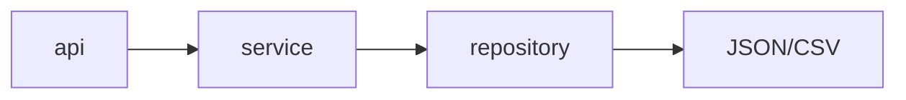
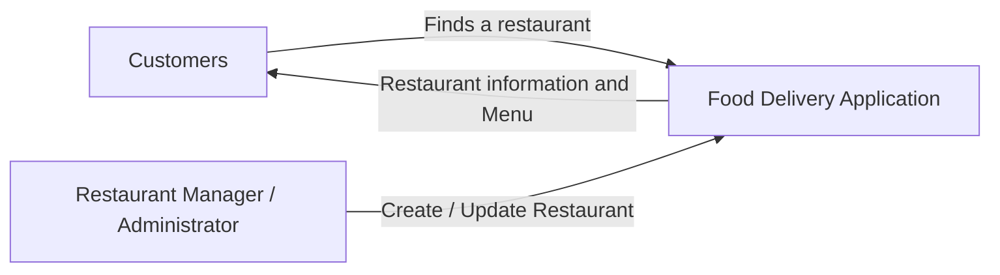
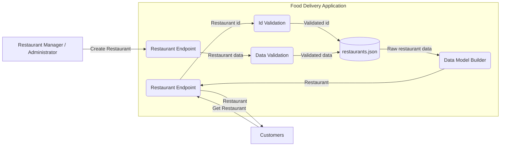
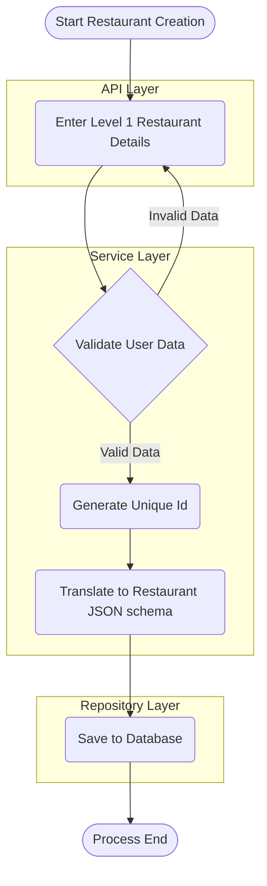
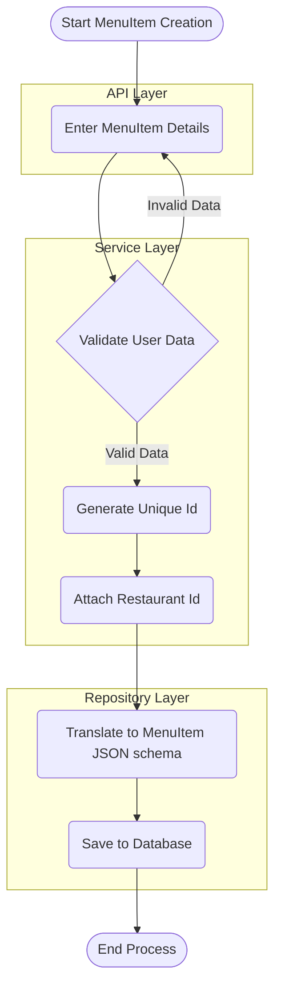
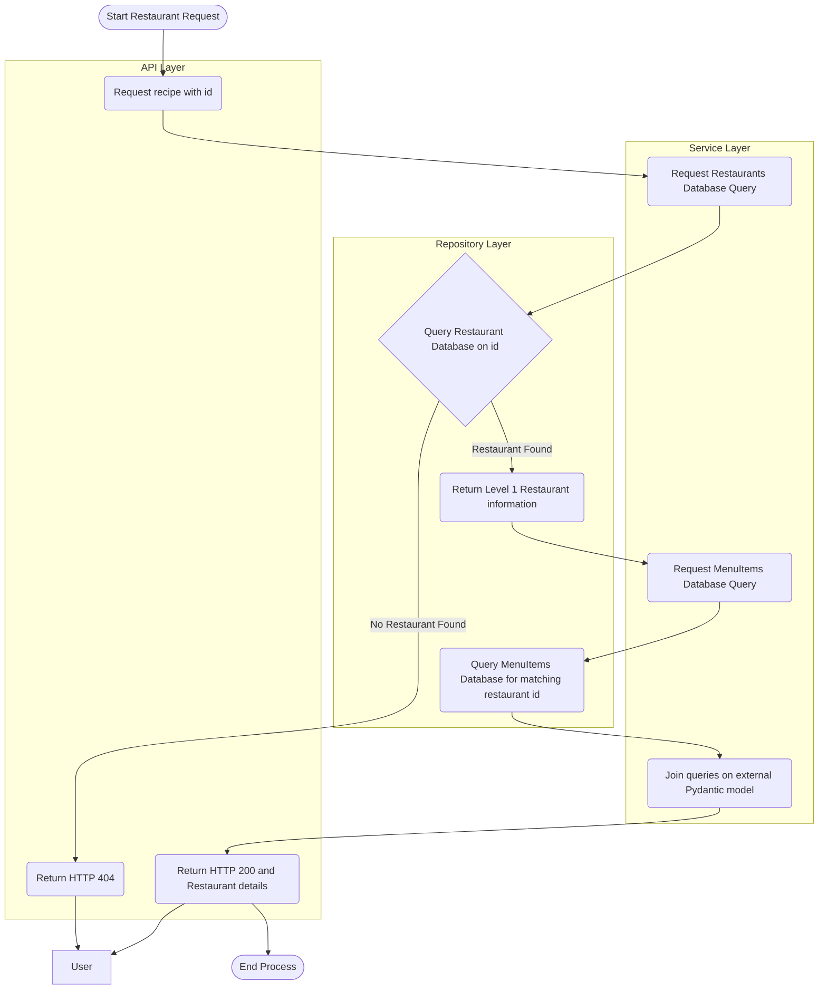
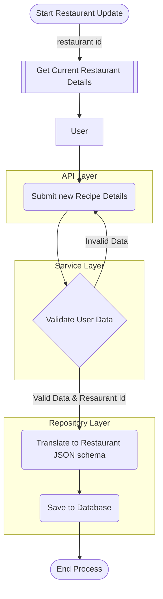
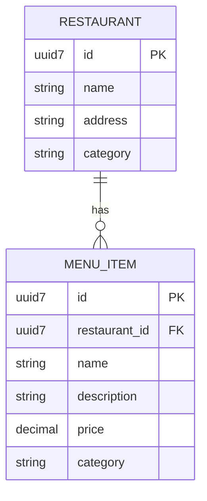
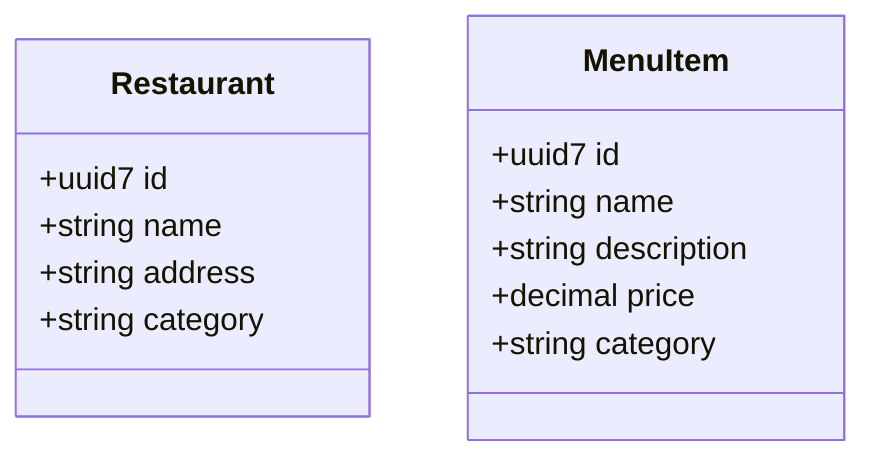

# Software Requirements Specification for Milestone 1

**Objective**: Implement ingtegrated restaurant-discovery and menu-browsing.

**Table Of Contents**:
- [Software Requirements Specification for Milestone 1](#software-requirements-specification-for-milestone-1)
  - [1. Introduction](#1-introduction)
    - [1.1 Purpose](#11-purpose)
    - [1.2 Document Conventions](#12-document-conventions)
    - [1.3 Milestone Scope](#13-milestone-scope)
      - [1.3.1 In Scope](#131-in-scope)
      - [1.3.2 Specifically Out of Scope](#132-specifically-out-of-scope)
    - [1.4 Definitions \& Acronyms](#14-definitions--acronyms)
  - [2. Overall Description](#2-overall-description)
    - [2.1 MenuItem Perspective](#21-menuitem-perspective)
    - [2.2 MenuItem Functions](#22-menuitem-functions)
    - [2.3 Required Architecture](#23-required-architecture)
    - [2.4 Design and Implementation Constraints](#24-design-and-implementation-constraints)
  - [3. System Features and Functional Requirements](#3-system-features-and-functional-requirements)
    - [3.1 Data](#31-data)
      - [3.1.1 Database](#311-database)
        - [3.1.1.1 Restaurants Database](#3111-restaurants-database)
        - [3.1.1.2 MenuItems Database](#3112-menuitems-database)
      - [3.1.2 Pydantic Models](#312-pydantic-models)
        - [3.1.2.1 Restaurant Model](#3121-restaurant-model)
        - [3.1.2.2 MenuItem Model](#3122-menuitem-model)
        - [3.1.2.3 Restaurant Input Model](#3123-restaurant-input-model)
        - [3.1.2.4 MenuItem Input Model](#3124-menuitem-input-model)
      - [3.1.3 Data Validation](#313-data-validation)
    - [3.2 Repository](#32-repository)
      - [3.2.1 Restaurant Repository](#321-restaurant-repository)
      - [3.2.2 MenuItem Repository](#322-menuitem-repository)
    - [3.3 API](#33-api)
      - [3.3.1 Restaurant API](#331-restaurant-api)
    - [3.4 Services](#34-services)
      - [3.4.1 Restaurant Service](#341-restaurant-service)
  - [4. External Interface Requirements](#4-external-interface-requirements)
  - [5. Non-Functional Requirements](#5-non-functional-requirements)
  - [6. Other Requirements](#6-other-requirements)
    - [6.1 Appendix A: Analysis Models](#61-appendix-a-analysis-models)
  - [7. Requirements Identification Summary](#7-requirements-identification-summary)

---

## 1. Introduction

### 1.1 Purpose

This Software Requirements Specification (SRS) document provides a comprehensive description of the Food Delivery Application for Milestone 1. The document details the functional and non-functional requirements for the application.

This SRS will serve as the foundation for the subsequent system design and development phases, ensuring that all group members have a clear understanding of what the system will do and how it will operate.

### 1.2 Document Conventions

This document follows these conventions:

| **Term** | **Description** |
| --- | --- |
| **SHALL** | Refers to a mandatory requirement that must be fufilled for Milestone 1. The group is required to cover this feature in the current implementation phase. |
| **SHOULD** | Indicates a requirement that is not required for this milestone, but may be included |
| **MAY** | Indicates a requirement that is not required for the next two milestones, but may be included in future iterations of the project. |

Requirements are categorized as follows:

| **Requirement Number** | **Description** |
| --- | --- |
| FR- | Functional Requirements |
| NFR- | Non-Functional Requirements |
| DATA- | Data requirements |
| TEST- | Testing requirements |

Every requirement category has its own sub-categories and a unique requirement number for that sub-category.

Examples: `FR-REPO-001` or `FR-API-001`

### 1.3 Milestone Scope

This milestone provides the first customer-facing and restaurant-management functionality.

#### 1.3.1 In Scope

The application will include the following key components:

- View a list of restaurants
- Retrieve the details of a specific restaurant
- view menus from restaurants
- search or filter restaurants
- Creating a restaurant
- Updating retaurant information
- Adding menu items
- Updating menu items

#### 1.3.2 Specifically Out of Scope

- Customer registration
- Restaurant Manager registration
- Authentication
- Authorization
- Shopping Carts
- Checkout
- Orders
- Deliveries

### 1.4 Definitions & Acronyms

- **CRUD**: Create, Read, Update, and Delete operations

---

## 2. Overall Description

### 2.1 MenuItem Perspective

This stage of the Food Delivery Application is a more comprehensive API, expanding restaurants to include restaurant menu items, along with expanded CRUD for all data.

### 2.2 MenuItem Functions

This stage of the Food Delivery Application will provide the following major functions:

1. **Restaurant Management**
  - Creating new restaurants
  - Updating existing restaurants
  - Adding menu items
  - Updating menu items
2. **Customer Functionality**
  - Viewing a list of all restaurants
  - Search or filter restaurants
  - Viewing the details of a specific restaurant
  - Viewing a list of menu items of a restaurant

### 2.3 Required Architecture

All interaction between the client and the data must follow the following architecture:



The client never sees any JSON from `data/`, instead only recieving proper Pydantic models.
The API endpoint is cannot hard-code any 

### 2.4 Design and Implementation Constraints

- Must use JSON or CSV for data persistence
- Local file I/O operations must handle concurrent write locks

---

## 3. System Features and Functional Requirements

This section details the functional requirements organized by major system features. Each requirement is identified with a [unique Id](#12-document-conventions) for tracability and reference.

### 3.1 Data 

#### 3.1.1 Database

##### 3.1.1.1 Restaurants Database

- **DATA-RST-007**: Each restaurant SHALL have a uuid7 unique id
- **DATA-RST-008**: Each restaurant SHALL have an `active` flag to indicate if the restaurant is currently active or not
- **DATA-RST-009**: Each restaurant SHALL have a cuisine

##### 3.1.1.2 MenuItems Database

- **DATA-MUI-001**: Menu Items SHALL be stored in `data/menu-items.json`
- **DATA-MUI-002**: A Menu Item SHALL have a uuid7 unique id
- **DATA-MUI-003**: A Menu Item SHALL have a link to a restaurant uuid7 id
- **DATA-MUI-004**: A Menu Item SHALL have a name
- **DATA-MUI-005**: A Menu Item SHALL have a description
- **DATA-MUI-006**: A Menu Item SHALL have a price
- **DATA-MUI-007**: A Menu Item SHOULD have an `active` flag to indicate if the menu item is currently active or not

#### 3.1.2 Pydantic Models

##### 3.1.2.1 Restaurant Model

- **DATA-PYD-001**: The `Restaurant` model SHALL use a uuid7 unique id
- **DATA-PYD-002**: The `Restaurant` model SHOULD have an `active` flag
  - Defaults to `True` upon creation

##### 3.1.2.2 MenuItem Model

- **DATA-PYD-003**: The `MenuItem` model SHALL use a uuid7 unique id
- **DATA-PYD-004**: The `MenuItem` model SHALL have a link to a restaurant uuid7 id
- **DATA-PYD-005**: The `MenuItem` model SHALL have a name
  - Cannot be `None`
- **DATA-PYD-006**: The `MenuItem` model SHALL have a description
  - Cannot be `None`
- **DATA-PYD-007**: The `MenuItem` model SHALL have a price
  - Must be a positive number
  - Must have at most 2 decimal places
- **DATA-PYD-008**: The `MenuItem` model SHOULD have an `active` flag
  - Default value is `True`

##### 3.1.2.3 Restaurant Input Model

- **DATA-PYD-008**: The `RestaurantInput` model SHALL have a name
  - Cannot be `None`
- **DATA-PYD-009**: The `RestaurantInput` model SHALL have an address
  - Cannot be `None`
- **DATA-PYD-010**: The `RestaurantInput` model SHALL have a cuisine
  - Cannot be `None`

##### 3.1.2.4 MenuItem Input Model

- **DATA-PYD-011**: The `MenuItemInput` model SHALL have a name
  - Cannot be `None`
- **DATA-PYD-012**: The `MenuItemInput` model SHALL have a price
  - Must have at most 2 decimal places
- **DATA-PYD-013**: The `MenuItemInput` model SHALL have a category
  - Cannot be `None`
  - Must be a non-empty string

#### 3.1.3 Data Validation

- **FR-SERV-001**: `RestaurantInput` data SHALL be validated on `Restaurant` domain integrity constraints before being persisted to the `Restaurants` repository
  - Valid data SHALL be passed to the service layer for further processing
  - Invalid data SHALL be rejected with `HTTP 422` and an appropriate error message
- **FR-SERV-002**: `MenuItemInput` data SHALL be validated on `MenuItem` domain integrity constraints before being persisted to the `MenuItems` repository
  - Valid data SHALL be passed to the service layer for further processing
  - Invalid data SHALL be rejected with `HTTP 422` and an appropriate error message

### 3.2 Repository

- **FR-REPO-001**: A repository SHALL have a file path to a JSON or CSV file for data persistence
- **FR-REPO-002**: A repository SHALL be able to write to the JSON or CSV file for data persistence
- **FR-REPO-003**: A repository SHALL be able to read from the JSON or CSV file for data persistence
- **FR-REPO-004**: A repository SHALL be able to handle concurrent read and write operations to the JSON or CSV file for data persistence
- **FR-REPO-005**: A repository SHALL be able to handle file not found errors gracefully
  - The repository SHALL return an empty list if the file is not found
  - The repository SHALL create a new file if the file is not found when writing data
- **FR-REPO-006**: A repository SHALL be able to be able to return a list of all items in the repository
- **FR-REPO-007**: A repository SHALL be able to retrieve an item by its unique id
  - The repository SHALL return `None` if the item is not found
- **FR-REPO-008**: A repository SHALL be able to add a new item to its corresponding JSON or CSV file
- **FR-REPO-009**: A repository SHALL be able to update an existing item in its corresponding JSON or CSV file
- **FR-REPO-010**: A repository SHOULD be able to delete an existing item in its corresponding JSON or CSV file
  - The repository SHALL return `False` if the item is not found
  - The repository SHALL return `True` if the item is successfully deleted

#### 3.2.1 Restaurant Repository

- **FR-REPO-011**: The restauant repository SHALL have a file path of `data/restaurants.json`
- **FR-REPO-012**: The restaurant repository SHALL be able to search for restaurants by name
  - The search SHALL be case-insensitive
  - The search SHALL return a list of matching restaurants
  - The search SHALL return an empty list if no matching restaurants are found
- **FR-REPO-013**: The restaurant repository SHALL be able to retrieve all cuisines from the list of restaurants
  - The cuisines SHALL be normalized
  - The repository SHALL return a list of unique cuisines
  - The repository SHALL return an empty list if no cuisines are found
- **FR-REPO-014**: The restaurant repository SHALL be able to filter restaurants by cuisine
  - The filter SHALL be case-insensitive
  - The filter SHALL return a list of matching restaurants
  - The filter SHALL return an empty list if no matching restaurants are found

#### 3.2.2 MenuItem Repository

- **FR-REPO-015**: The menu item repository SHALL have a file path of `data/menu-items.json`
- **FR-REPO-016**: The menu item repository SHALL be able to retrieve all menu items for a given restaurant id
  - The repository SHALL return a list of matching menu items
  - The repository SHALL return an empty list if no matching menu items are found

### 3.3 API

#### 3.3.1 Restaurant API

- **FR-API-004**: The `POST /restaurants` endpoint SHALL create a new restaurant
  - Accepts the `RestaurantInput` model as the request body
  - The endpoint SHALL return `HTTP 201` and the created restaurant if successful
  - The endpoint SHALL return `HTTP 422` and an error message if the request body is invalid

### 3.4 Services

#### 3.4.1 Restaurant Service

- **FR-SERV-003**: The restaurant service SHALL be able to create a new restaurant object
  - The service SHALL generate a uuid7 unique id for the new restaurant
  - The service SHALL validate the `RestaurantInput` model before creating the restaurant
  - The service SHALL return the created restaurant if successful
  - The service SHALL raise an exception if the request body is invalid

---

## 4. External Interface Requirements

This section describes the requirements for the external interfaces of the system, including user interfaces, hardware interfaces, software interfaces, and communication interfaces.

---

## 5. Non-Functional Requirements

---

## 6. Other Requirements

### 6.1 Appendix A: Analysis Models

**1. Context Diagram**

- System Boundaries and external entities (Level 0)



- Data flows between the system and external entities (Level 1)



**2. Process Flow Diagrams**

- Restaurant Creation



- MenuItem Creation



- Retrieve Restaurant Details



- Update Restaurant




**3. Entity Relationship Diagram**

**3.1 Data Persistence**



- Pydantic Models



**4. Use Case Diagrams**

- Customer Use Case Diagram

```mermaid
flowchart
direction LR

Customer@{shape: person, label: "Customer"}

subgraph "Food Delivery Application"
  A(View a list of restaurants)
  B(Filter restaurants by category)
  C(Search for restaurants by name)
  D(View details of a single restaurant)
  E(View menu of a single restaurant)
end

Customer --> A
Customer --> B
Customer --> C
Customer --> D
Customer --> E
```

- Restaurant Manager Use Case Diagram

```mermaid
flowchart
direction LR
RestaurantManager@{shape: person, label: "Restaurant Mangager"}

subgraph "Food Delivery Application"
  A("Manage restaurant details")
  B("Add new menu items")
  C("Deactivate old menu items")
  D("Update existing menu item details")
  E("Update existing menu item price")
end

RestaurantManager --> A
RestaurantManager --> B
RestaurantManager --> C
RestaurantManager --> D
RestaurantManager --> E
```

---

## 7. Requirements Identification Summary

**Data-Management-Requirements**

- Next ID for restaurant data requirement: `DATA-RST-010`
- Next ID for menu item data requirement: `DATA-MUI-008`
- Next ID for data validation requirement: `DATA-PYD-014`

**Functional Requirements**

- Next ID for initialization requirement: `FR-INIT-005`
- Next ID for repository requirement: `FR-REPO-017`
- Next ID for service requirement: `FR-SERV-004`
- Next ID for api requirement: `FR-API-005`